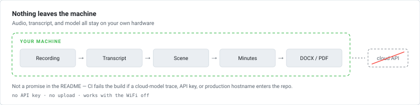
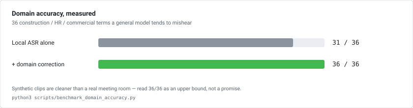
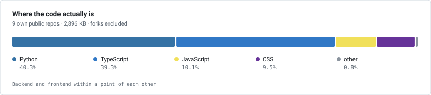
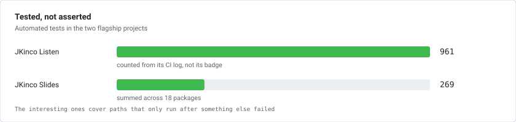

  

<h1 align="center">Wenxuan Zhang</h1>

  <b>AI Application Engineer</b> · Shanghai 
  I build tools for work whose data is not allowed to leave the building.

  <b>English</b> · <a href="README.zh-CN.md">简体中文</a>

  
  
  

---

## The constraint everything is built around

A construction supervision meeting produces two hours of audio. In this industry that audio
often **cannot legally leave the building** — not to a transcription service, not to an LLM
API, not to a bucket in someone else's region. So the recording sits on a phone, and someone
retypes the minutes that night, from memory, at 11pm.

Cloud tools can't take that job. Whisper-class models stop at a raw transcript and leave the
hard part — *what was decided, and who now owns it* — untouched.

So I build the other kind of tool: the whole pipeline on your own hardware.

  <picture>
    <source media="(prefers-color-scheme: dark)" srcset="assets/chart-pipeline-dark.svg" />
    
  </picture>

**What I actually work on:** construction-supervision digitalisation · multimodal data
platforms (image–text pair extraction, tiered review, structured export) · AI tooling
(presentation software, WeChat mini-programs, office automation).

---

## 🚩 JKinco Listen · 筑听

**A local-first AI meeting-minutes workbench.** Recording → transcript → scene detection →
structured minutes → DOCX/PDF, entirely on your own machine. No API key, no cloud call.

  
  
  
  
  

  

<table>
<tr>
<td width="50%" valign="top">

 <b>The workbench.</b> Live transcript on the left, the structured minutes assembling themselves on the right.
</td>
<td width="50%" valign="top">

 <b>The output.</b> A construction progress review, filled into the template that scene detection picked.
</td>
</tr>
</table>

### What makes it more than a wrapper

- **The classifier's rules outrank the model.** Meeting type decides which template is used,
  and the wrong template produces a document asserting the wrong legal responsibility. So a
  rules-based evidence gate runs first and wins; the model may downgrade a classification but
  never promote one.
- **The privacy claim is enforced, not asserted.** CI fails the build if any cloud-model
  trace, API key, or production hostname enters the repository.
- **961 tests**, and the interesting ones cover paths that only run when something else has
  already failed — a chunk that came back empty, a disk that filled mid-recording, a browser
  that refused to give up the microphone.
- **Domain accuracy is measured, not asserted.**

  <picture>
    <source media="(prefers-color-scheme: dark)" srcset="assets/chart-benchmark-dark.svg" />
    
  </picture>

Writing that benchmark is what turned up three of its own problems: the correction table had
been written from imagination (none of its thirteen rules ever fired), 17 of the 36 target
words were missing from the lexicon, and the scoring itself was under-reporting by counting a
mid-term comma as a recognition failure. A benchmark that only ever confirms you were right
isn't measuring anything — [read how it runs](https://github.com/wenxuanzhang1209-cyber/jkinco-listen-open/blob/main/docs/BENCHMARK.md).

Submitted to <a href="https://github.com/Hannibal046/Awesome-LLM/pull/794">Awesome-LLM #794</a> — open, awaiting review.

---

## The rest of the family

<table>
<tr>
<td width="50%" valign="top">

 <b><a href="https://github.com/wenxuanzhang1209-cyber/jkinco-slides">JKinco Slides</a></b>
 An AI-native presentation studio where every object stays editable — and PPTX survives the round trip, which is the part everyone else skips.
 <code>18 packages · 269 tests</code>
</td>
<td width="50%" valign="top">

 <b><a href="https://github.com/wenxuanzhang1209-cyber/JKinco-Skills-Lab">JKinco Skills Lab</a></b>
 Brand design frozen into agent skills. The reference art is the contract — that's what stops the output drifting between runs.
 <code>2 skills + reference system</code>
</td>
</tr>
<tr>
<td width="50%" valign="top">

 <b><a href="https://github.com/wenxuanzhang1209-cyber/personal-life-hub">NORTH · Life Hub</a></b>
 Work, life and private notes on one timeline — with boundaries, so they don't bleed into each other.
 <code>localStorage only · zero network calls</code>
</td>
<td width="50%" valign="top">

 <b><a href="https://github.com/wenxuanzhang1209-cyber/recipe-miniprogram">Recipe Mini Program</a></b>
 A WeChat mini-program with enough real data that search and ranking behave like production — shipped with a quality audit that names its own defect.
 <code>10,000 recipes · 96,908 ingredient links</code>
</td>
</tr>
<tr>
<td width="50%" valign="top">

 <b><a href="https://github.com/wenxuanzhang1209-cyber/video-share-site">Video Room</a></b>
 One video, one page, one link — no platform wrapped around it, no account required to watch.
 <code>96 lines of JS</code>
</td>
<td width="50%" valign="top">
<b><a href="https://github.com/wenxuanzhang1209-cyber/jkinco-tools">JKinco Tools</a></b>
 Small automation scripts that verify their own work. The mirror tool re-hashes every file it copies and checks it against the Git SHA-1 — so "it worked" is a measurement, not a hope.
 <code>6,407 files, 0 failures · standard library only</code>
  
<b><a href="https://wenxuanzhang1209-cyber.github.io/">Portfolio site</a></b>
 The long-form version of this page.
</td>
</tr>
</table>

---

## By the numbers

Two charts I generate from the GitHub API rather than borrowing from a stats service — the
usual cards count repositories instead of code, and count forks as if I'd written them. One
fork in this account holds 50 MB of Rust I have never touched, which is enough to make a
Python-and-TypeScript developer look like a Rust developer.

  <picture>
    <source media="(prefers-color-scheme: dark)" srcset="assets/chart-languages-dark.svg" />
    
  </picture>
  <picture>
    <source media="(prefers-color-scheme: dark)" srcset="assets/chart-tests-dark.svg" />
    
  </picture>

Every number on this page was measured, and a
[weekly workflow](.github/workflows/verify-numbers.yml) re-measures them from the source
repositories. If one drifts, this README fails its own CI — which has already caught a test
count that had quietly gone stale.

---

## Stack

  
  
  
  
  
  
  
  
  
  

---

  
  <b>JKinco</b> — local-first tools for work whose data cannot leave the building ·
  <a href="https://github.com/wenxuanzhang1209-cyber/jkinco-listen-open">Listen</a> ·
  <a href="https://github.com/wenxuanzhang1209-cyber/jkinco-slides">Slides</a> ·
  <a href="https://github.com/wenxuanzhang1209-cyber/JKinco-Skills-Lab">Skills Lab</a> ·
  <a href="https://github.com/wenxuanzhang1209-cyber/personal-life-hub">Life Hub</a> ·
  <a href="https://github.com/wenxuanzhang1209-cyber/jkinco-tools">Tools</a>
  

  Open to collaboration on local-first AI tooling and engineering-industry data problems.

