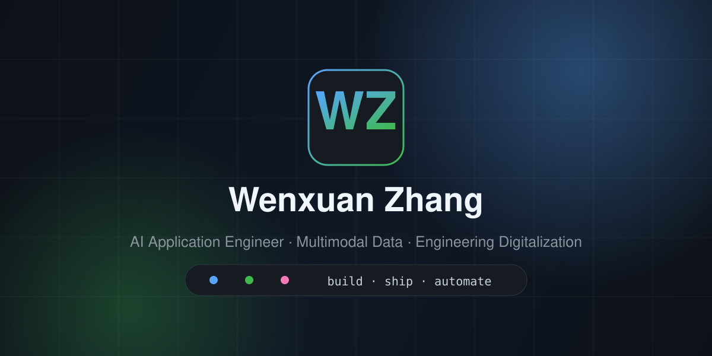

  

<h1 align="center">Wenxuan Zhang</h1>

  <b>AI Application Engineer</b> · Shanghai 
  I build tools that take the repetitive parts of engineering work off people's hands. 
  把工程行业里重复、繁琐的工作交给工具

  
  
  

---

## What I work on

**Construction supervision, digitised.** Site-process recognition, field annotation, and the
data work behind it. The constraint that shapes everything: this industry's recordings and
documents often cannot legally leave the building — so the tools have to run locally.

**Multimodal data platforms.** Image–text pair extraction and proofreading, question
generation, tiered review, structured export.

**AI tooling.** Presentation software, WeChat mini-programs, office automation.

Three things I care about in every project: **reproducible, documented, and simpler than what
it replaced.**

工程监理数字化 · 多模态数据平台 · AI 工具开发。三个坚持：可复现、有文档、把复杂流程变简单。

---

## 🚩 JKinco Listen · 筑听

**A local-first AI meeting-minutes workbench.** Recording → transcript → scene detection →
structured minutes → DOCX/PDF, entirely on your own machine. No API key, no cloud call.

  

Most meeting tools force a trade: cloud services want your audio uploaded, and Whisper-class
models stop at a raw transcript. For a construction review, an interview, or a client visit,
neither is acceptable — so people type the notes by hand.

What makes it more than a wrapper:

- **The classifier's rules outrank the model.** Meeting type decides which template is used,
  and the wrong template produces a document asserting the wrong legal responsibility. So a
  rules-based evidence gate runs first and wins; the model may downgrade a classification but
  never promote one.
- **The privacy claim is enforced, not asserted.** CI fails the build if any cloud-model
  trace, API key, or production hostname enters the repository.
- **924 tests**, and the interesting ones cover paths that only run when something else has
  already failed.

本地优先的 AI 会议纪要工作台。录音 → 转写 → 场景识别 → 结构化纪要 → 导出，全程不出本机。
场景判定用规则证据门控，模型只能降级不能升级——套错模板等于让文件写错责任主体。

Submitted to <a href="https://github.com/Hannibal046/Awesome-LLM/pull/794">Awesome-LLM #794</a> — open, awaiting review.
已向 Awesome-LLM 投稿（PR #794），待评审。

---

## Other work

| Project | What it is |
| --- | --- |
| [**JKinco Slides**](https://github.com/wenxuanzhang1209-cyber/jkinco-slides) | AI-native presentation studio with object-level editing and PPTX round-trip · `React` `TypeScript` |
| [**Personal Life Hub**](https://github.com/wenxuanzhang1209-cyber/personal-life-hub) | Local-first hub for timeline, tasks, and reviews · `React` `TypeScript` `Vite` |
| [**Recipe Mini Program**](https://github.com/wenxuanzhang1209-cyber/recipe-miniprogram) | WeChat mini-program with 10,000+ home-style recipes · `Node.js` `Express` |
| [**JKinco Skills Lab**](https://github.com/wenxuanzhang1209-cyber/JKinco-Skills-Lab) | Reusable AI skills for posters, product video, and onboarding · `Skills` `Prompts` |
| [**JKinco Tools**](https://github.com/wenxuanzhang1209-cyber/jkinco-tools) | Lightweight automation scripts · `Python` |

Everything above is MIT-licensed.

---

## Stack

  
  
  
  
  
  
  
  

  
  

---

  Open to collaboration on local-first AI tooling and engineering-industry data problems. 
  欢迎就本地优先的 AI 工具与工程行业数据问题交流。

